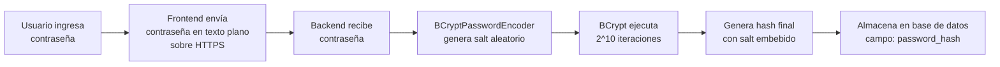

# 🔐 Encriptación de Contraseñas en Nexus

## Resumen Ejecutivo

Nexus utiliza **BCrypt** como algoritmo de hash para el almacenamiento seguro de contraseñas de usuario. BCrypt es un estándar de la industria reconocido por su resistencia a ataques de fuerza bruta y rainbow tables.

---

## 📋 Tabla de Contenidos

1. [¿Qué es BCrypt?](#qué-es-bcrypt)
2. [Características Técnicas](#características-técnicas)
3. [Implementación en Nexus](#implementación-en-nexus)
4. [Flujo de Encriptación](#flujo-de-encriptación)
5. [Ventajas de Seguridad](#ventajas-de-seguridad)
6. [Ejemplos Prácticos](#ejemplos-prácticos)
7. [Comparación con Otros Algoritmos](#comparación-con-otros-algoritmos)

---

## 🔍 ¿Qué es BCrypt?

**BCrypt** es una función de hash de contraseñas basada en el cifrado **Blowfish**, diseñada específicamente para ser computacionalmente costosa y resistente a ataques de hardware especializado.

### Origen
- **Diseñado por**: Niels Provos y David Mazières en 1999
- **Basado en**: Algoritmo de cifrado Blowfish
- **Propósito**: Proteger contraseñas mediante hashing adaptativo

---

## ⚙️ Características Técnicas

### 1. **Salt Automático**
BCrypt genera automáticamente un **salt** (valor aleatorio) único para cada contraseña:
- **Longitud del salt**: 128 bits (16 bytes)
- **Generación**: Aleatoria usando un CSPRNG (Cryptographically Secure Pseudo-Random Number Generator)
- **Integración**: El salt se almacena junto con el hash en la misma cadena

### 2. **Factor de Coste (Work Factor)**
El "cost factor" determina la complejidad computacional:
- **Rango**: 4-31
- **Default en Spring Security**: 10
- **Iteraciones**: 2^cost (2^10 = 1,024 iteraciones)
- **Tiempo aproximado** (cost=10): ~100ms por hash

### 3. **Estructura del Hash**

Un hash BCrypt tiene el siguiente formato:

```
$2a$10$N9qo8uLOickgx2ZMRZoMyeIjZAgcfl7p92ldGxad68LJZdL17lhWy
│  │  │                   │
│  │  │                   └─ Hash (31 caracteres)
│  │  └───────────────────── Salt (22 caracteres)
│  └────────────────────────── Cost factor (10)
└─────────────────────────────── Identificador de versión ($2a)
```

**Desglose**:
- `$2a$`: Versión del algoritmo BCrypt
- `10`: Cost factor (2^10 iteraciones)
- `N9qo8uLOickgx2ZMRZoMye`: Salt codificado en Base64
- `IjZAgcfl7p92ldGxad68LJZdL17lhWy`: Hash resultante

### 4. **Algoritmo de Hashing**

```
BCrypt(password, salt, cost) = Blowfish_EksBlowfish(cost, salt, password)
```

**Proceso interno**:
1. Se genera un salt aleatorio de 128 bits
2. Se deriva una clave del algoritmo usando la contraseña y el salt
3. Se ejecuta el cifrado Blowfish modificado (Expensive Key Setup) 2^cost veces
4. El resultado se codifica junto con el salt y el cost factor

---

## 🏗️ Implementación en Nexus

### Configuración (SecurityConfig.java)

```java
@Configuration
@EnableWebSecurity
public class SecurityConfig {
    
    @Bean
    public PasswordEncoder passwordEncoder() {
        return new BCryptPasswordEncoder();
        // Usa cost factor por defecto: 10
        // Equivalente a: new BCryptPasswordEncoder(10)
    }
}
```

### Uso en el Servicio (UserService.java)

```java
@Service
@RequiredArgsConstructor
public class UserService {
    
    private final PasswordEncoder passwordEncoder;
    
    @Transactional
    public RegisterResponse registerUser(RegisterRequest request) {
        // Encriptación de la contraseña
        String hashedPassword = passwordEncoder.encode(request.getPassword());
        
        User user = User.builder()
            .email(request.getEmail())
            .passwordHash(hashedPassword) // Se almacena el hash BCrypt completo
            .displayName(request.getDisplayName())
            .build();
        
        return userRepository.save(user);
    }
    
    public boolean verifyPassword(String rawPassword, String hashedPassword) {
        // Verificación automática usando el salt embebido
        return passwordEncoder.matches(rawPassword, hashedPassword);
    }
}
```

---

## 🔄 Flujo de Encriptación

### Durante el Registro



### Ejemplo Real

**Input (Registro)**:
```
Contraseña original: "Nexus2025!"
```

**Output (Base de Datos)**:
```sql
password_hash: "$2a$10$EixZaYVK1fsbw1ZfbX3OXePaWxn96p36WQoeG6Lruj3vjPGga31lW"
```

**Características del hash almacenado**:
- ✅ 60 caracteres de longitud
- ✅ Salt único incluido
- ✅ Cost factor visible ($10)
- ✅ Irreversible
- ✅ La misma contraseña genera hashes diferentes cada vez

---

## 🛡️ Ventajas de Seguridad

### 1. **Resistencia a Rainbow Tables**
- Cada contraseña tiene un salt único
- No es posible pre-computar hashes

### 2. **Protección contra Fuerza Bruta**
- Cost factor ajustable (actualmente 2^10 = 1,024 iteraciones)
- A mayor cost, más tiempo por intento
- Se puede incrementar el cost sin cambiar contraseñas existentes

### 3. **Adaptabilidad al Hardware**
- El cost factor puede aumentarse con el tiempo
- Mantiene la seguridad a medida que el hardware mejora

### 4. **Sin Reversibilidad**
- Es matemáticamente imposible obtener la contraseña original del hash
- La única forma de verificar es re-hashear y comparar

### 5. **Protección contra Timing Attacks**
- BCrypt incluye protección contra ataques de temporización
- El tiempo de verificación es constante

---

## 💡 Ejemplos Prácticos

### Ejemplo 1: Mismo Password, Diferentes Hashes

```java
String password = "MiPassword123";

String hash1 = passwordEncoder.encode(password);
// $2a$10$N9qo8uLOickgx2ZMRZoMyeIjZAgcfl7p92ldGxad68LJZdL17lhWy

String hash2 = passwordEncoder.encode(password);
// $2a$10$Q8jFxZVWqXH4JmDFkN7x5.GmKhpGz9Y3rZQaXWLm9TyPqXxZ7nMoK

// Ambos hashes son válidos para la misma contraseña
passwordEncoder.matches(password, hash1); // true
passwordEncoder.matches(password, hash2); // true
```

### Ejemplo 2: Verificación de Contraseña

```java
// Durante el login
String rawPassword = "Nexus2025!";
String storedHash = "$2a$10$EixZaYVK1fsbw1ZfbX3OXePaWxn96p36WQoeG6Lruj3vjPGga31lW";

// BCrypt extrae el salt del hash y re-hashea la contraseña
boolean isValid = passwordEncoder.matches(rawPassword, storedHash);
// true si la contraseña es correcta
```

### Ejemplo 3: Costo Computacional

```java
// Con cost factor 10 (default)
long start = System.currentTimeMillis();
passwordEncoder.encode("password123");
long time = System.currentTimeMillis() - start;
// Aproximadamente 100ms

// Con cost factor 12
PasswordEncoder strongEncoder = new BCryptPasswordEncoder(12);
start = System.currentTimeMillis();
strongEncoder.encode("password123");
time = System.currentTimeMillis() - start;
// Aproximadamente 400ms (4x más lento)
```

---

## 📊 Comparación con Otros Algoritmos

| Característica | BCrypt | MD5 | SHA-256 | PBKDF2 | Argon2 |
|---|---|---|---|---|---|
| **Diseñado para passwords** | ✅ | ❌ | ❌ | ✅ | ✅ |
| **Salt automático** | ✅ | ❌ | ❌ | ✅ | ✅ |
| **Resistente a GPU/ASIC** | ⚠️ | ❌ | ❌ | ⚠️ | ✅ |
| **Cost factor ajustable** | ✅ | ❌ | ❌ | ✅ | ✅ |
| **Estándar de la industria** | ✅ | ❌ | ❌ | ✅ | ⚠️ |
| **Soporte en Spring Security** | ✅ | ✅ | ✅ | ✅ | ⚠️ |
| **Velocidad** | Lenta (intencional) | Muy rápida | Muy rápida | Lenta | Lenta |
| **Año de creación** | 1999 | 1991 | 2001 | 2000 | 2015 |

### Por qué BCrypt para Nexus

1. **Madurez**: 25+ años de uso en producción
2. **Soporte nativo**: Incluido en Spring Security
3. **Balance seguridad/rendimiento**: Adecuado para aplicaciones web
4. **Compatibilidad**: Funciona en cualquier entorno
5. **Facilidad de uso**: API simple y bien documentada

---

## 🔒 Mejores Prácticas Implementadas

### ✅ En Nexus

1. **HTTPS obligatorio**: Las contraseñas nunca viajan sin cifrar
2. **No se almacena texto plano**: Solo el hash BCrypt
3. **Salt único por usuario**: Generado automáticamente
4. **Cost factor razonable**: 10 (balance entre seguridad y UX)
5. **Sin límites artificiales**: No restringimos caracteres especiales
6. **Validación en frontend**: Requisitos mínimos antes de enviar

### ⚠️ Consideraciones Futuras

- **Incrementar cost factor**: A medida que el hardware mejora (cada 2-3 años)
- **Migración a Argon2**: Cuando Spring Security 6+ lo soporte nativamente
- **2FA**: Agregar autenticación de dos factores como capa adicional

---

## 📚 Referencias

- [BCrypt Algorithm - Provos & Mazières, 1999](https://www.usenix.org/legacy/event/usenix99/provos/provos.pdf)
- [Spring Security PasswordEncoder](https://docs.spring.io/spring-security/reference/features/authentication/password-storage.html)
- [OWASP Password Storage Cheat Sheet](https://cheatsheetseries.owasp.org/cheatsheets/Password_Storage_Cheat_Sheet.html)
- [How BCrypt Works](https://auth0.com/blog/hashing-in-action-understanding-bcrypt/)

---

## 🤝 Conclusión

BCrypt proporciona un nivel robusto de seguridad para Nexus, balanceando:
- **Seguridad** contra ataques modernos
- **Rendimiento** aceptable para aplicaciones web
- **Simplicidad** de implementación y mantenimiento

La elección de BCrypt con cost factor 10 es apropiada para una aplicación como Nexus, donde la seguridad de las contraseñas es crítica pero el volumen de autenticaciones es manejable.

---

**Versión del documento**: 1.0  
**Última actualización**: Noviembre 2025  
**Autor**: Equipo Nexus
